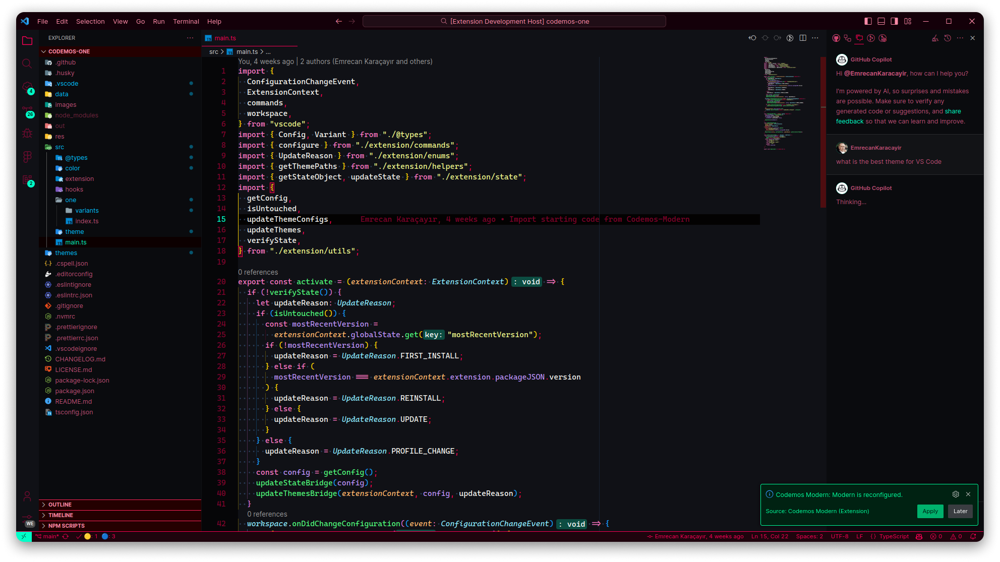
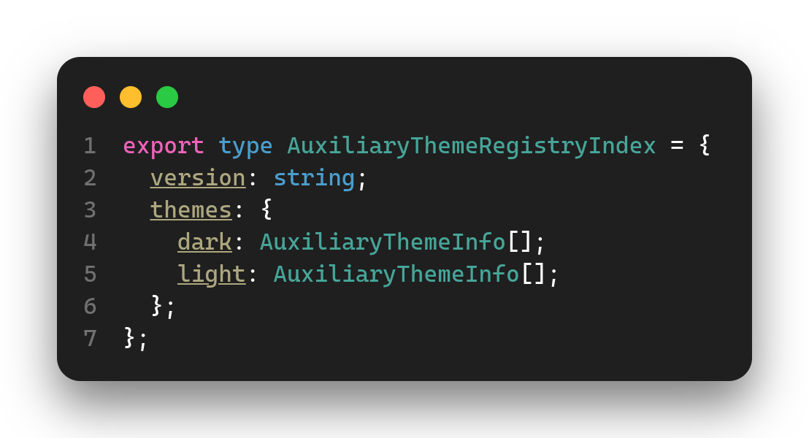
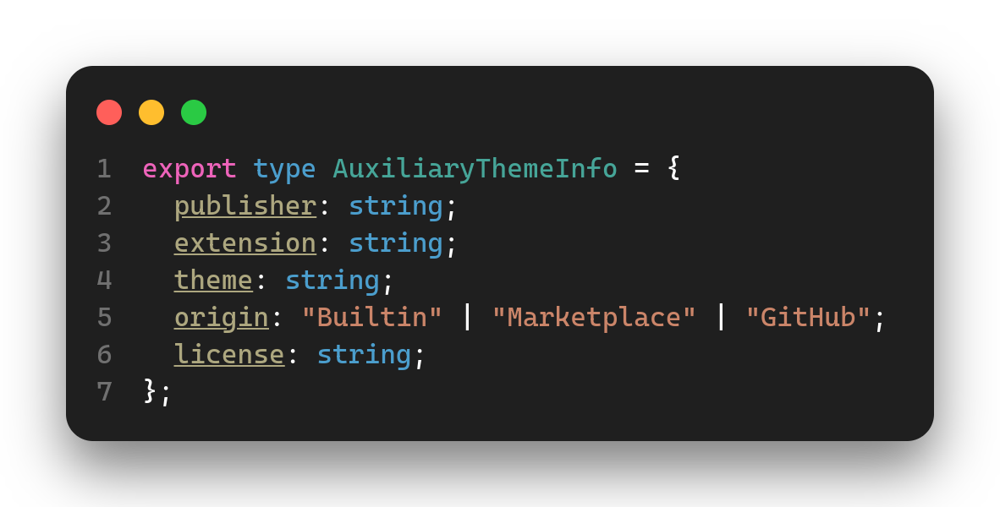

# Auxiliary Theme Registry ✓

This is the official and verified auxiliary theme registry from Codemos.

### 🔗 Compatibility

The table below showcases the compatibility between different distributions of this registry and their respective supported distributions of [Codemos Modern](https://github.com/Codemos-Inc/Codemos-Modern).

| Registry Distribution | Supported Codemos Modern Distribution |
| --------------------- | ------------------------------------- |
| v1.1.2 - latest       | v2.4.0 - latest                       |
| v0.0.1 - v1.1.1       | v2.0.0 - v2.3.1                       |

### 🎯 Target

As being the official repository, our target is to provide a curated list of themes that are beloved by VS Code users. We want to include **all Marketplace theme extensions down to 50k downloads**. This doesn't mean that we'll only host the most popular themes in marketplaces, we are open to contributions from the community. We will review the themes and register them to the registry if they meet our quality standards. Our catalog grows rapidly and is updated regularly.

<h3 id="subs">❤️ Subscription</h3>

Add the fallowing entry to your `settings.json` file.

```jsonc
{ // settings.json
  "codemosModern.auxiliaryThemeRegistries": [
    // ...
    "Codemos-Inc/Auxiliary-Theme-Registry",
    // ...
  ]
}
```

### 🎨 Catalog

Individual publishers & themes are listed in the `index.json` file at the root of this repository. You can find the list of themes in the `themes` property of the `index.json` file. Each theme is represented by an object with the following properties.

- **Publisher:** The publisher of the theme.
- **Extension:** The name of the extension containing the themes.
- **Theme:** The name of the theme.
- **Origin:** The origin of the theme.
- **License:** The license of the theme.

## 📚 Table of Contents

- [📖 About](#rdme-about)
- [📝 Documentation](#rdme-docs)
  - [✒️ Terminology](#rdme-docs-term)
  - [📦 Structure](#rdme-docs-str)
    - [📂 registry](#rdme-docs-str-reg)
    - [📄 index.json](#rdme-docs-str-ind)
    - [📄 CHANGELOG.\*](#rdme-docs-str-clog)
    - [📄 LICENSE.\*](#rdme-docs-str-lic)
    - [📄 README.\*](#rdme-docs-str-rdme)
  - [🌐 Publishing](#rdme-pub)
    - [🎨 Themes](#rdme-pub-theme)
    - [📦 Registries](#rdme-pub-reg)
  - [🪄 Updating](#rdme-up)
    - [🎨 Themes](#rdme-up-theme)
    - [📦 Registries](#rdme-up-reg)
- [📋 Change Log](#rdme-clog)
- [🙌🏼 Contribution](#rdme-contrib)
- [📜 License](#rdme-license)

<h2 id="rdme-about">📖 About</h2>

Auxiliary theme registries are complementary repositories for the [VS Code](https://github.com/microsoft/vscode) extension [Codemos Modern](https://github.com/Codemos-Inc/Codemos-Modern). Modern is an innovative theme suite/hub for VS Code that helps you configure its look & feel. This repository and many others from the community helps to bring third-party themes from different sources to be used in Modern to give more freedom to its users when configuring VS Code's look & feel. **In short; it is a repository for hosting third-party themes which are then side-loaded to VS Code with the help of the Codemos Modern.**

Modern users are able to **access a wide variety of themes** from different sources. The main sources including; extension marketplaces ([VS Marketplace](https://marketplace.visualstudio.com), [Open VSX](https://open-vsx.org/)), GitHub repositories, and unpublished themes. Users only need to subscribe to desired auxiliary theme registries by adding them to Modern's configuration (see [subscription](#subs)) and they will be able to access the themes hosted from those registries.

Installed auxiliary themes can be used in Modern's modules to **mix & match different themes**. For example, you can use the Cyberpunk theme as the UI theme and the Dracula theme as the code (syntax) theme. _Possibilities are endless._

### A little taste of modularity



<div align="center">

**UI Theme:** [Cyberpunk](https://marketplace.visualstudio.com/items?itemName=max-SS.cyberpunk) | **Code Theme:** [Dracula Official](https://marketplace.visualstudio.com/items?itemName=dracula-theme.theme-dracula)

</div>

<h2 id="rdme-docs">📝 Documentation</h2>

In this section, you can find detailed information about the modularity system, how its used in Modern and how you can create & manage your own registry.

<h3 id="rdme-docs-term">✒️ Terminology</h3>

- **Modularity:** Modularity is a feature of Codemos Modern that allows mixing multiple themes together.
- **Auxiliary theme registry:** A [GitHub](https://github.com) repository that hosts auxiliary themes.
  - **Owner:** The GitHub user or organization that owns the auxiliary theme registry.
  - **Repo:** The GitHub repository that is the auxiliary theme registry.
  - **Registry index:** A JSON file that contains the list of themes in a registry.
    - **Version:** The version of the registry index. (This is used to determine if the registry index is up-to-date.)
- **Auxiliary theme:** A Third-party theme (non-bundled) that is made available to be used in Modern.
  - **Auxiliary theme info:** A JSON object that contains information about a theme in `index.json`.
    - **Publisher:** Publisher of the extension that contains VS Code themes. (This is usually the publisherId in the marketplaces, but if the extension is not published to any marketplaces, it can be the publisher's GitHub username or the organization name.)
    - **Extension:** The name of the extension that contains VS Code themes.
    - **Theme:** The name of the VS Code theme.
    - **Origin:** The origin of the theme. It has predefined values like; `Built-in`, `Marketplace`, `GitHub`.
    - **License:** The license of the extension. (In order a theme to be included in the registry, it must have a license and that license must allow redistribution.)

<h3 id="rdme-docs-str">📦 Structure</h3>

A standard auxiliary theme registry repository has the following type of structure.

```text
┌─📂 registry
│  ├─📂 publisher1
│  │  └─📂 extension1
│  │     ├─📄 theme1-dark.json
│  │     └─📄 LICENSE
│  └─📂 publisher2
│     ├─📂 extension2
│     │  ├─📄 Theme 2.json
│     │  └─📄 LICENSE.md
│     └─📂 extension3
│        ├─📄 theme3-dark.json
│        ├─📄 theme4-light.json
│        └─📄 LICENSE.txt
├─📄 index.json
├─📄 CHANGELOG.*
├─📄 LICENSE.*
└─📄 README.*
```

The bare minimum criteria of an auxiliary theme registry is to host:

- 1 publisher,
- 1 extension,
- 1 theme.

Even though this is perfectly fine, we still encourage you to request a registration for your theme to another well populated registry.

This will help:

- Your theme to reach more users.
- Keep the number of registries low and current ones more populated.
- Modern users to find the themes they are looking for more easily.

Let's take a look at the structure of an auxiliary theme registry in detail.

<h4 id="rdme-docs-str-reg">📂 registry</h4>

This is the folder that contains all auxiliary themes in the registry. The name of the folder must be `registry` and its structure is crucial for the registry to work properly.

It contains folders for each publisher.

##### 📂 registry / 📂 \<publisher\>

The name of the publisher folder must be the publisher's name (must be unique within the registry), it is case insensitive.

Publisher name can be obtained from:

- **VS Marketplace:** If the extension published to the [VS Marketplace](https://marketplace.visualstudio.com), it is the publisherId or if the publisher chose to provide a display name, it can be used as well.
- **Open VSX Registry:** If the extension published to the [Open VSX Registry](https://open-vsx.org/), it is the namespace or if the publisher chose to provide a display name, it can be used as well.
- **Github:** If the extension published to the [GitHub](https://github.com), it is the owner's username or the organization name.

Publisher folders contain folders for each of their extensions.

##### 📂 registry / 📂 \<publisher\> / 📂 \<extension\>

The name of the extension folder must be the extension's name (must be unique within the publisher), it is case insensitive.

Extension names can be obtained from:

- **VS Marketplace:** If the extension is published to the [VS Marketplace](https://marketplace.visualstudio.com), it is the extensionId or if the publisher chose to provide a display name for the extension, it can be used as well.
- **Open VSX Registry:** If the extension is published to the [Open VSX Registry](https://open-vsx.org/), it is the extensionId or if the publisher chose to provide a display name for the extension, it can be used as well.
- **Github:** If the extension is published to the [GitHub](https://github.com), it is the repository name.

Extension folders contains the theme files and a license file.

##### 📂 registry / 📂 \<publisher\> / 📂 \<extension\> / 📄 \<theme\>.json

The name of the theme file must be the theme's name followed by `.json` extension (must be unique within the extension), it is case insensitive. Theme files must be valid VS Code JSON theme files.

Theme names **must** be obtained from:

- **VS Code theme selector:** The name of the theme that is displayed in the theme selector. Open the theme selector with: `Ctrl/Cmd + K, Ctrl/Cmd + T` or `Ctrl/Cmd + Shift + P` and type `Preferences: Color Theme` and press `Enter` to open the theme selector.

##### 📂 registry / 📂 \<publisher\> / 📂 \<extension\> / 📄 LICENSE.\*

The name of the license file must be `LICENSE.*`. We recommend using `.md` format for the license file. The license file must contain the license of the extension. (In order a theme to be included in a registry, it must have a license and that license must allow redistribution.)

If we find out that any registry contains themes that are **not licensed or the license doesn't allow redistribution, we will ban the registry** from the list of registries.

> If you are the publisher/owner of an extension that is hosted in an auxiliary theme registry and you want your extension to be removed, please open an issue in that registry's repository. If you can't get a response from the registry maintainer(s), please contact us at `support@codemos.dev` email.

<h4 id="rdme-docs-str-ind">📄 index.json</h4>

Index file is the file that contains the list of themes in the registry. Modern uses `index.json` file to locate & categorize themes, update the registry and show the required information about its content. It is located at the root of the repository and its name must be `index.json`. It must be a valid index file.

##### How to construct an index file?

Expected `index.json` file structure shown in fallowing images.

> **NOTE:** The `index.json` file will be validated against these type definitions and will fail if it doesn't match, leaving you with a nonoperational registry.

This is the type definition of the object Modern expects to find as the root object in the `index.json` file.

- **version:** The version of the registry index. Must be in semver format. (This is used to determine if the registry index is up-to-date.)
- **themes:** The list of themes in the registry.
  - **dark:** The list of dark themes in the registry.
  - **light:** The list of light themes in the registry.



This is the type definition of the object Modern expects to find as the auxiliary theme entries in `themes.<variant>[]` property of the `index.json` file. (More info at [Terminology](#rdme-docs-term") section.)



##### Example `index.json` file for the imaginary registry

```text
┌─📂 registry
│  ├─📂 publisher1
│  │  └─📂 extension1
│  │     ├─📄 theme1-dark.json
│  │     └─📄 LICENSE
│  └─📂 publisher2
│     ├─📂 extension2
│     │  ├─📄 Theme 2.json
│     │  └─📄 LICENSE.md
│     └─📂 extension3
│        ├─📄 theme3-dark.json
│        ├─📄 theme4-light.json
│        └─📄 LICENSE.txt
├─📄 index.json
├─📄 CHANGELOG.*
├─📄 LICENSE.*
└─📄 README.*
```

This was our imaginary registry's structure. Let's construct the `index.json` file for this registry.

Important notes:

- Verify that the value of the properties `publisher`, `extension`, and `theme` matches with corresponding folder and file names.
- Modern requires registries to correctly categorize themes as dark/light variants. This is required to eliminate incompatibilities between themes. (For example, users can't use a dark theme as the UI theme and a light theme as the code (syntax) theme.)
- `publisher`, `extension`, `theme` property values are case insensitive, but we recommend using the exact names to avoid confusion.
- The value of the `theme` property will be shown when selecting themes so it is suggested to use a display name that is more readable like 'Theme 2' and not 'theme1-dark' in the example 'index.json' file.
- Modern updates registry indexes by comparing the `version` property value in the `index.json` with the version of the repository's latest release tag. If the version of the `index.json` is lower than the latest release tag, Modern will update the registry index, clearing all cached/installed themes. (This is done to reduce the number of requests to the registry repository.) So, it is important to update the `version` property value when you are preparing for the next release.
- You should only use `Marketplace` or `GitHub` as the value of the `origin` property. The value `Bundled` is only used by Codemos to indicate that the theme is bundled with Modern and `Built-in` is only used to indicate that the theme is a built-in theme of VS Code.

Example `index.json` for the imaginary registry:

```jsonc
{
  "version": "v1.0.0", // Must follow the semver format.
  "themes": {
    "dark": [
      {
        "publisher": "publisher1",
        "extension": "extension1",
        "theme": "theme1-dark", // Don't add '.json' file extension.
        "origin": "Marketplace",
        "license": "GPL-3.0"
      },
      {
        "publisher": "publisher2",
        "extension": "extension2",
        "theme": "Theme 2",
        "origin": "GitHub",
        "license": "Apache-2.0" // Must be a valid SPDX license identifier.
      },
      {
        "publisher": "publisher2",
        "extension": "extension3",
        "theme": "theme3-dark", // Should be human readable like 'Theme 3 (Dark)'.
        "origin": "GitHub",
        "license": "MIT"
      }
    ],
    "light": [
      {
        "publisher": "publisher2",
        "extension": "extension3",
        "theme": "theme4-light",
        "origin": "GitHub", // Must be one of the predefined values.
        "license": "MIT"
      }
    ]
  }
}
```

<h4 id="rdme-docs-str-clog">📄 CHANGELOG.*</h4>

This is your registry's changelog file. It is not forced to be in a specific format, but we recommend using the [Keep a Changelog](https://keepachangelog.com) format.

<h4 id="rdme-docs-str-lic">📄 LICENSE.*</h4>

This is your registry's license file. We strongly recommend using a permissive license like MIT, Apache-2.0, BSD-3-Clause, etc. for your registry.

<h4 id="rdme-docs-str-rdme">📄 README.*</h4>

This is your registry's readme file. It must be built upon a template readme. This template readme file named `TEMPLATE.md` can be found at the root of this repository. You can use it as a starting point for your registry's readme file.

<h3 id="rdme-pub">🌐 Publishing</h3>

<h4 id="rdme-pub-theme">🎨 Themes</h4>

Publishing an extension/theme is as easy as requesting a registration for your extension/theme. You can request a registration by opening an issue in any of the registries you want your extension/theme to be hosted. Or as always, you can create your own registry and host your own extension/theme.

<h4 id="rdme-pub-reg">📦 Registries</h4>

Publishing a registry has some simple steps to follow:

- You can start by forking this repository or by creating a new one.
- Prepare the [structure](#rdme-docs-str) of the repository.
- Find some great extensions to be hosted.
- Arrange the the [structure](#rdme-docs-str) and the `index.json` file.
- Prepare the `README.*` file from the `TEMPLATE.md` file at the root of this repository.
- Create a release tag with the version of the `index.json` file.
- Share your registry with the community 🎉.

> **NOTE:** You can get a verified badge for your registry by opening an issue here at our official registry. We will review your registry and if it meets our quality standards, we will add it to the list of verified registries. Verified registries are promoted where possible.

Important notes:

- Modern looks for the latest release when installing/updating registries. So, you should always create a release tag with the updated `version` property in the `index.json` file.
  - **Tag format:** `vMajor.Minor.Patch` (e.g. `v1.0.0`)
- When you are the owner of the auxiliary theme registry, **you are** the responsible for maintaining the registry **not Codemos**.
- Occasionally, Modern is updated and breaking changes may happen. You as the registry owners will be informed ahead of the time to prepare for the update.
- Currently our system is not automated, you have to make sure that the registry is perfectly valid and up-to-date. We are working on automating the process and we will update this document when we are ready.

<h3 id="rdme-up">🪄 Updating</h3>

<h4 id="rdme-up-theme">🎨 Themes</h4>

Updating an extension/theme is as easy as requesting an update for your extension/theme. You can request an update by opening an issue in any of the registries your extension/theme being hosted.

<h4 id="rdme-up-reg">📦 Registries</h4>

Updating a registry is very straightforward:

- Make the changes,
- Update the `index.json` file,
- Create a release tag with the updated `version` property in the `index.json` file.

##### What happens when a registry is updated?

1. Modern checks for registry updates whenever it is interacted with.
2. It checks for the latest release tag of the registry's repository.
3. If there is an update, it removes everything about the registry and cleans its cache.
4. It downloads the latest version of the registry.
5. Your registry is ready to be used again.

<h2 id="rdme-clog">📋 Change Log</h2>

Changes from the last major release shown below. If you want to see the full change log, visit [CHANGELOG.md](https://github.com/Codemos-Inc/Auxiliary-Theme-Registry/blob/main/CHANGELOG.md).

### Added

- README.md file with detailed documentation.
- CHANGELOG.md file.
- TEMPLATE.md file for community auxiliary theme registries.

<br/>

<h2 id="rdme-contrib">🙌🏼 Contribution</h2>

We are open to any kind of contribution. If you want to contribute to Auxiliary Theme Registry, please join us on [GitHub](https://github.com/Codemos-Inc/Auxiliary-Theme-Registry).

<br/>

<h2 id="rdme-license">📜 License</h2>

 Codemos Auxiliary Theme Registry is licensed under the [MIT License](https://github.com/Codemos-Inc/Auxiliary-Theme-Registry/blob/main/LICENSE.md).
